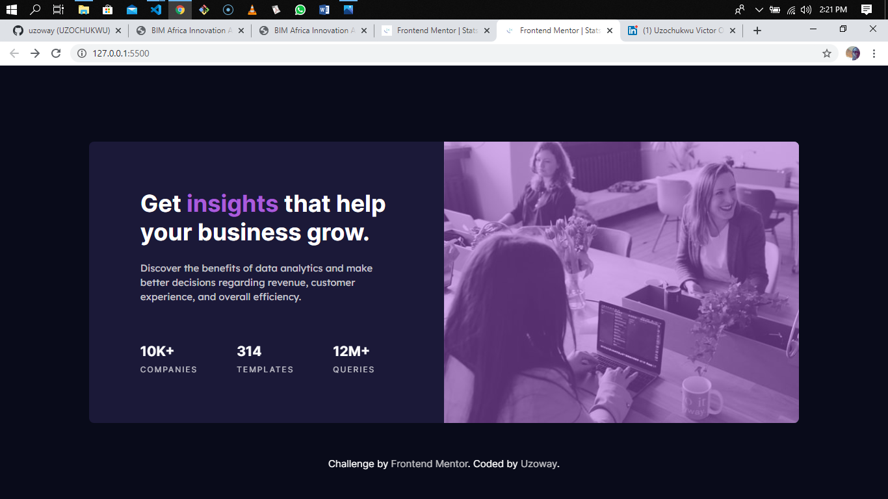

# Frontend Mentor - Stats preview card component solution

This is a solution to the [Stats preview card component challenge on Frontend Mentor](https://www.frontendmentor.io/challenges/stats-preview-card-component-8JqbgoU62). Frontend Mentor challenges help you improve your coding skills by building realistic projects. 

## Table of contents

- [Overview](#overview)
  - [The challenge](#the-challenge)
  - [Screenshot](#screenshot)
  - [Links](#links)
- [My process](#my-process)
  - [Built with](#built-with)
  - [What I learned](#what-i-learned)
  - [Continued development](#continued-development)
- [Author](#author)
- [Acknowledgments](#acknowledgments)

## Overview

### The challenge

Users should be able to:

- View the optimal layout depending on their device's screen size

### Screenshot



### Links

- Solution URL: [Add solution URL here](https://your-solution-url.com)
- Live Site URL: [Add live site URL here](https://your-live-site-url.com)

## My process

### Built with

- Semantic HTML5 markup
- CSS custom properties
- Flexbox
- Desktop-first workflow

### What I learned

I took on this challenge to refresh some of my Frontend web coding skills. Some of which are:

- Using the CSS flexbox
- Building a single webpage which is responsive on various mobile screen sizes.
- Creating animation on page load.

Below is a code snippet of how I animated the heading on page load.

```html
<h1>Get <span>insights</span> that help your business grow.</h1>
```

```css
.hero .banner .banner-col .banner-col-text h1{
    font-size: 2.4rem;
    font-family: 'Inter', sans-serif;
    color: hsl(0, 0%, 100%);
    margin-bottom: 1.5rem;
    animation: slidedown .9s linear 1;
    animation-delay: .5s;
    visibility: hidden;
    animation-fill-mode: forwards;
}

/** Animation for the main heading **/
@keyframes slidedown{
    0%{
        transform: translateY(-2rem);
        visibility: visible;
    }
    100%{
        transform: translateY(0);
        visibility: visible;
    }
}
```

### Continued development

Super proud of my progress so far especially with my CSS skills. The animation on the page looks clean and smooth to me but I'm definitely going to keep working on them because I believe there is still room for improvements.

## Author

- GitHub - [uzoway](https://github.com/uzoway)
- Frontend Mentor - [@uzoway](https://www.frontendmentor.io/profile/uzoway)
- Twitter - [@Uzoway_](https://twitter.com/Uzoway_)
- LinkedIn - [Uzochukwu Victor Okafor](https://www.linkedin.com/in/uzochukwu-victor-okafor-0702a2188/)

## Acknowledgments

I'll like to thank the entire team at [Frontend Mentor](https://www.frontendmentor.io). for putting together yet another wonderful design to help Frontend Web Developers build realistic projects.
